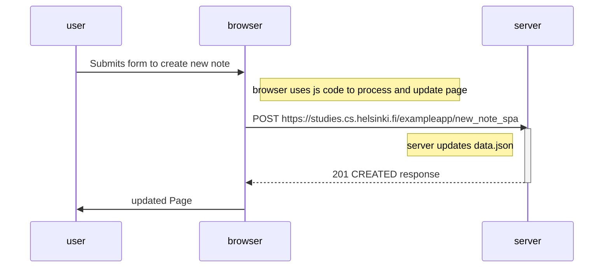

```mermaid
    sequenceDiagram 
        participant user;
        participant browser;
        participant server;

        user ->> browser: Submits form to create new note

        note right of browser: browser uses js code to process and update page
        
        browser ->> server: POST https://studies.cs.helsinki.fi/exampleapp/new_note_spa
        activate server
        note left of server: server updates data.json
        server -->> browser: 201 CREATED response
        deactivate server

        browser ->> user: updated Page

```