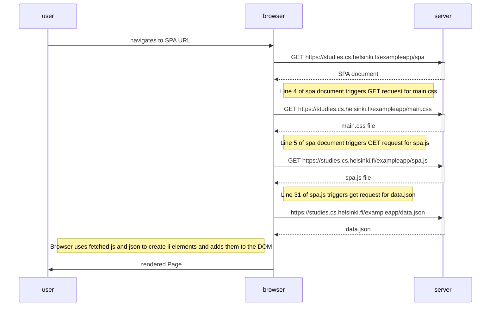

```mermaid
    sequenceDiagram 
        participant user;
        participant browser;
        participant server;

        user ->> browser: navigates to SPA URL

        browser->> server: GET https://studies.cs.helsinki.fi/exampleapp/spa
        activate server
        server -->> browser: SPA document
        deactivate server

        Note right of browser: Line 4 of spa document triggers GET request for main.css
        browser ->> server: GET https://studies.cs.helsinki.fi/exampleapp/main.css
        activate server
        server -->> browser: main.css file 
        deactivate server

        Note right of browser: Line 5 of spa document triggers GET request for spa.js
        browser ->> server: GET https://studies.cs.helsinki.fi/exampleapp/spa.js
        activate server
        server -->> browser: spa.js file 
        deactivate server

        Note right of browser: Line 31 of spa.js triggers get request for data.json
        browser ->> server: https://studies.cs.helsinki.fi/exampleapp/data.json
        activate server
        server -->> browser: data.json
        deactivate server

        note left of browser: Browser uses fetched js and json to create li elements and adds them to the DOM

        browser ->> user: rendered Page

```